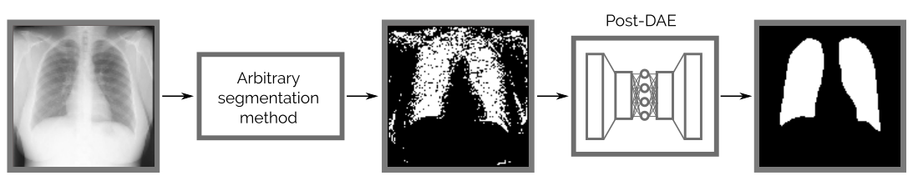
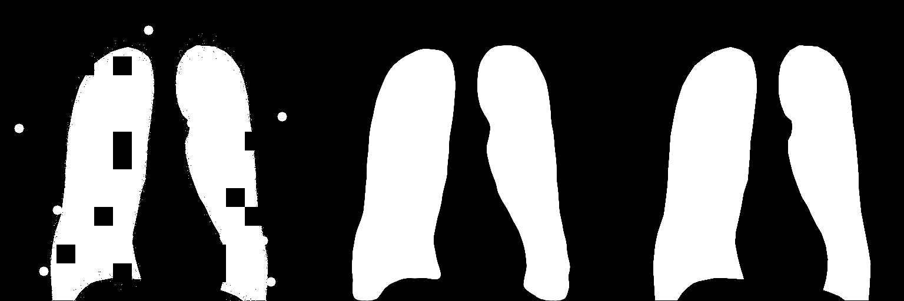
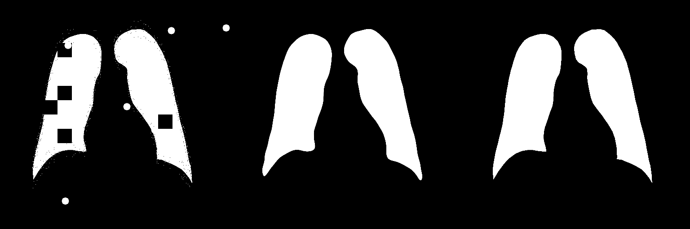
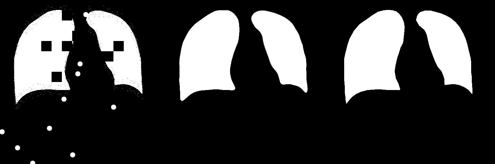

# Anatomical Priors for Image Segmentation via Post-processing with Denoising Autoencoders
This is an unofficial PyTorch implementation of [Anatomical Priors for Image Segmentation via Post-processing with Denoising Autoencoders](https://link.springer.com/chapter/10.1007/978-3-030-32226-7_65)


*Post-DAE works as a post-processing step and improves the anatomical  plausibility of segmentation masks obtained with arbitrary methods.*

## TransUNet
- We verify, that DAE can be used as an independent post-processing step to correct problematic and non-anatomically plausible masks produced by arbitrary segmentation methods.
- This is a method that can be trained using segmentation-only datasets or anatomical masks coming from arbitrary image modalities, since the DAE is trained using only segmentation masks, and no intensity information is required during learning. [1]
- We validate Post-DAE in the context of lung segmentation in X-ray images, showing its robustness by improving segmentation masks

## Usage

1. Clone this repo using :
```
git clone https://github.com/balazsborsos/dae_postprocessing
``` 
2. Install the requirements using :
```
pip install -r requirements.txt
```
3. To start model training run the main.py file with following arguments :
```
python train -t "PATH_TO_CONFIG" -i "PATH_TO_MASKS"
```

An example config yml can be found in the utils folder. The input is just the path to the masks of the dataset, corruptions take place in the training script.

## Results

&nbsp;&nbsp;&nbsp;&nbsp;&nbsp;&nbsp;&nbsp;&nbsp;&nbsp;&nbsp;&nbsp;&nbsp;&nbsp;&nbsp;&nbsp;&nbsp; **Original Image** &nbsp;&nbsp;&nbsp;&nbsp;&nbsp;&nbsp;&nbsp;&nbsp;&nbsp;&nbsp;&nbsp;&nbsp;&nbsp;&nbsp; &nbsp;&nbsp;&nbsp;&nbsp;&nbsp;&nbsp;&nbsp;&nbsp;&nbsp;&nbsp;&nbsp;&nbsp;&nbsp;&nbsp;&nbsp;&nbsp;&nbsp;&nbsp;&nbsp;&nbsp;&nbsp;&nbsp;&nbsp;&nbsp;&nbsp; **Predicted** 
&nbsp;&nbsp;&nbsp;&nbsp;&nbsp;&nbsp;&nbsp;&nbsp;&nbsp;&nbsp;&nbsp;&nbsp;&nbsp;&nbsp;&nbsp;&nbsp;&nbsp;&nbsp;&nbsp;&nbsp;&nbsp;&nbsp;&nbsp;&nbsp;&nbsp;&nbsp;&nbsp;&nbsp;&nbsp;&nbsp;&nbsp;&nbsp;&nbsp;&nbsp;&nbsp;&nbsp;&nbsp;&nbsp;&nbsp;&nbsp;&nbsp;&nbsp; **Ground Truth** 








## Dataset
- Chest Xray Masks and Labels [2] dataset was used for training.
- Dataset can be accessed freely on Kaggle.
- The data was complied for papers [3] and [4]

## Citation

The arvix version of the paper can found at the following [link](https://arxiv.org/pdf/1906.02343v1.pdf).

If you find this repo useful please cite the original authors :
```
@inproceedings{larrazabal2019anatomical,
  title={Anatomical priors for image segmentation via post-processing with denoising autoencoders},
  author={Larrazabal, Agostina J and Martinez, Cesar and Ferrante, Enzo},
  booktitle={Medical Image Computing and Computer Assisted Intervention--MICCAI 2019: 22nd International Conference, Shenzhen, China, October 13--17, 2019, Proceedings, Part VI 22},
  pages={585--593},
  year={2019},
  organization={Springer}
}
```

## References
- [1] [Anatomical Priors for Image Segmentation via Post-processing with Denoising Autoencoders](https://link.springer.com/chapter/10.1007/978-3-030-32226-7_65)
- [2] [Kaggle page of Dataset](https://www.kaggle.com/datasets/nikhilpandey360/chest-xray-masks-and-labels)
- [3] [Automatic tuberculosis screening using chest radiographs](https://pubmed.ncbi.nlm.nih.gov/24108713/)
- [4] [Lung segmentation in chest radiographs using anatomical atlases with nonrigid registration](https://pubmed.ncbi.nlm.nih.gov/24239990/)